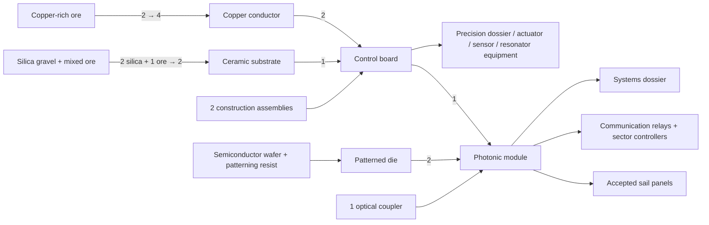

# Technology and production progression — revision B

Date: 2026-09-12. Status: detailed design and inspection UI; proposed research and recipes are not implemented. Asset generation still awaits approval.

## What changed after review

The first draft mapped technology themes and left most equipment dependencies in prose. This revision treats **research, recipes, manufacturing equipment, operational services and milestone conditions as separate, connected records**. It includes the complete item/equipment catalog, not just the names of technology tiers.

Open **Technology → Items & equipment → Dev: full tree**. Search for an item such as **Photonic module**, **Reference-locked source**, or **Inspected flight sail**. The selected-recipe view draws inputs, producer and unlocking technology on the left, the selected item in the middle, and downstream consumers on the right. Select **Complete ingredient ancestry** to trace back through intermediates, or **All visible connections** to inspect the entire graph. Scroll and zoom to inspect the full graph; Fit graph is an overview. Every research card also links to each specific unlocked recipe, machine and capability.

The comprehensive specification is [009 — Item and equipment dependencies](009-production-dependencies.md). Its branch diagrams include every incoming recipe, producer, service, science and prerequisite edge. [The full Mermaid source](009-full-production-graph.mmd) contains the combined graph. These artifacts are generated from the same catalog used by the panel with `npm run docs:progression`.

## Current game versus proposed progression

Current gameplay provides all nine machine recipes, routing, baseline diagnostics, repairs and automatic control immediately. The guardian gates crystal access; qualification gates blueprint capture. There is still no live research economy. Existing machine costs and field behavior stay as implemented. The catalog labels current entries and proposals explicitly.

The proposed research model takes inspiration from Factorio's [science-funded research](https://wiki.factorio.com/Research) and [trigger technologies](https://www.factorio.com/blog/post/fff-376): all technology parents are required; laboratories consume manufactured dossiers; a few one-time field achievements open new stages. New research enables new equipment and recipes. It does not change physical laws or remove existing basic diagnostics.

An item does not magically unlock another item merely by existing. Three distinct conditions normally apply: **research grants the recipe; ingredients fund its construction; its producer and services make it operable**. A laboratory also consumes science items, and milestone technologies require demonstrated behavior. The graph gives these relations different colors and labels. Machines named as recipe inputs are consumed as recovered equipment; machines named as producers/services remain installed.

## Concrete chains

The production chain also creates equipment upgrades: recovered reference station + resonator cores + control boards → reference-locked source; recovered emitter + pulse capacitors + control boards → pulse driver; recovered assembler + steel + actuators + precision lenses → field-assisted fabrication cell. Source arrays and fabrication feed the systems tier, which splits into a qualified planetary aperture and an inspected flight sail before final launch.

Prepared materials now unlocks copper-rich ore, silica and carbon access, a material processor, steel, conductors, ceramic, polished crystal and control boards. The former abstract control-board recipe is replaced by **2 assemblies + 2 conductors + 1 ceramic → 1 board / 6 s**. Photonic modules now require **2 patterned dies + 1 optical coupler + 1 board → 1 module / 8 s**, rather than a direct crystal-to-module jump.

Research dependencies were corrected accordingly: modular construction, thermal management and layered defenses require prepared materials. Precision fabrication requires thermal management as well as precision research and modular construction. Every input, producing machine and operating-service technology is checked against the consumer's research ancestry.

## Research economy and bootstrap

| Dossier | Recipe | Producer | Recipe unlocked by |
| --- | --- | --- | --- |
| Industrial | 2 assemblies + 1 frontier crystal → 1 / 4 s | Research workbench | Industrial research foundation |
| Precision | 1 industrial dossier + 1 control board + 1 polished crystal → 1 / 6 s | Research workbench | Precision research |
| Systems | 1 precision dossier + 1 photonic module + 1 accepted precision part → 1 / 10 s | Research workbench | Integrated photonics |

First crystal and a qualified outpost blueprint grant the **construction recipes** for the research workbench and laboratory. Build the workbench from 12 assemblies + 2 crystal (6 power), and the lab from 8 assemblies + 3 crystal (12 power). No research pack is required to build the producer of the first research pack. The project node describes deploying this foundation; deployment does not gate the construction recipe behind itself.

Each research unit consumes one of **each** specified dossier, atomically. For example, 80 × industrial + precision means 80 of each, not 80 split between them. Times are laboratory-seconds per unit at speed 1. One global queue permits supplied laboratories to contribute in parallel. Supply interruptions, pause and cancellation retain earned progress; future save data stores both research and permanent milestone history. Qualification remains local and can be invalidated independently of learned technology.

The actual expedition starts with an extractor, assembler and generator, avoiding the assembly → assembler → assembly production bootstrap loop. New equipment can always be constructed with the expedition kit from available stock. Future assembler recipe selection is unlocked by the corresponding technology. It does not imply the current runtime can already make those proposed items.

## Resource access and failure recovery

The current 64×36 finite sector is insufficient for the complete tree. Before research spending ships, expand the cleared frontier with guaranteed deposits accessible to the existing extractor, wires and belts. Initial provision: **120,000 mixed ore, 60,000 crystal, 20,000 copper-rich ore, 20,000 silica and 5,000 carbon** across reachable deposits. Copper/silica/carbon access comes with prepared materials; none requires the long-range machinery it helps research. These are balancing provisions, not simulated deposits in this patch.

The exact theoretical research-only raw demand is generated in 009. It excludes machine construction, defense ammunition, transport, final launch hardware, rejected production and recovery. Balance these additional sinks and guarantee a recovery reserve before enabling the full economy. All raw materials have explicit deposit access; sealed coolant uses carbon and crystal so it does not depend on an unspecified water/fluid economy.

Precision parts require a powered, cooled fabrication cell and ≥10 useful process-field units, stable within ±5% over the 8-second cycle. The existing reference/emitter/controller toolkit must be able to satisfy this contract before advanced source research. Otherwise systems science would deadlock behind its own advanced equipment. Unqualified output becomes counted scrap. Semiconductor and coolant recipes are gameplay abstractions, not claims of literal industrial chemistry.

## Endgame integration

An aperture sector consumes 2 recovered locked sources, 4 amplifiers, 4 emitters, 1 sector controller, 2 return guards and 40 steel. It still needs installed grid, coolant, communications, beacon, tracking and surveyed-site services. Pass ≥100 useful units for 60 seconds with no trip to qualify each sector.

A membrane line makes film panels, a metrology gantry certifies them, and a sail dock joins **100 accepted panels + 20 photonic modules** into one inspected flight sail in 120 seconds. Lightsail launch research/project prerequisites expose the cradle construction recipe before its final acceptance, avoiding another self-gate. The release requires one inspected sail, four qualified sectors, live tracking, and ≥400 combined useful units for 120 seconds under drift, with no trip or tracking loss. The deployed production network will require expanded map and machine limits before implementation.

## Review and validation

Review specific recipes and equipment dependencies in 009, the three dossier families, the access/recovery provisions, and the acceptance contracts. Generation of new sprites remains pending approval; [008](008-animation-production-plan.md) defines frame budgets for the existing machines and creatures. The catalog's equipment entries will drive future asset batches one implemented tier at a time.

Validation checks cover graph references, concrete unlock coverage, prerequisite closure for every ingredient/producer/service, science recipe availability, bootstrapping from the actual starter installation, and fidelity to current machine costs. Browser checks cover recipe search, item-to-item traversal, producer links, research navigation, full-graph visibility, viewport controls and absence of world mutation.

Validation completed: production build passes; all 41 headless checks and all 10 browser scenarios pass. After final diagram routing adjustments, the build and both targeted progression browser tests passed again. Reviewed the full graph and the photonic-module recipe screenshots in `test-results/`. No research state, crafting behavior or generated raster assets changed.

<!-- progression:start -->
## Research schedule and concrete unlock counts

The full catalog contains 5 resources, 31 manufactured items, 43 equipment/tooling entries and 20 operating capabilities.

| Research | All prerequisites | Cost / acquisition | Specific unlocked entries |
| --- | --- | --- | --- |
| Automated outpost | — | Expedition equipment | Expedition construction kit; Mixed ferrous ore; Construction assembly; Extractor; Assembler; Power unit; Material belt route; Electrical wire route; Repair and recovery |
| Field engineering | Automated outpost | Expedition equipment | Reference station; Four-port junction; Phase tuner; Field emitter; Cooled dump; Field link; Baseline diagnostics; Automatic phase control; Focused target delivery |
| Perimeter defense | Automated outpost | Expedition equipment | Perimeter sentry; Defense readiness |
| Open the frontier | Field engineering | Gameplay milestone · no research cost | Frontier crystal; Eastern frontier access |
| First crystal | Open the frontier | Gameplay milestone · no research cost | Harvested crystal milestone |
| Qualified outpost | Open the frontier | Gameplay milestone · no research cost | Qualified outpost blueprint |
| Industrial research | First crystal, Qualified outpost | Project conditions | Research workbench; Research laboratory; Industrial dossier; Research queue |
| Structured logistics | Industrial research | 40 × Industrial dossier · 10 s / unit | Belt splitter; Underground belt pair; Constructible belt segment; Transport segment editing |
| Instrumented networks | Industrial research | 30 × Industrial dossier · 10 s / unit | Monitor station; Branch probe |
| Power distribution | Industrial research | 40 × Industrial dossier · 10 s / unit | Power pole; Substation; Shared electrical bus |
| Prepared materials | Industrial research | 50 × Industrial dossier · 10 s / unit | Copper-rich ore; Silica gravel; Carbon nodules; Material processor; Structural steel; Copper conductor; Ceramic substrate; Polished crystal; Control board |
| Modular construction | Structured logistics, Qualified outpost, Prepared materials | 60 × Industrial dossier · 15 s / unit | Service connector; Selected-area blueprint; Construction request |
| Thermal management | Instrumented networks, Prepared materials | 40 × Industrial dossier · 15 s / unit | Coolant charge; Coolant pipe; Coolant pump; Heat exchanger; Branch isolation switch |
| Layered defenses | Power distribution, Perimeter defense, Prepared materials | 40 × Industrial dossier · 15 s / unit | Perimeter wall; Sentry magazine; Repair kit; Supplied perimeter sentry; Repair depot |
| Precision research | Prepared materials, Instrumented networks | 60 × Industrial dossier · 15 s / unit | Precision dossier; Precision lens; Precision actuator; Resonator core; Sensor head |
| Long-range transport | Modular construction, Power distribution, Precision research | 80 × Industrial dossier + Precision dossier · 20 s / unit | Freight depot; Cargo carrier; Restricted-mode conduit |
| Stable source arrays | Precision research, Thermal management | 80 × Industrial dossier + Precision dossier · 20 s / unit | Reference-locked source; Gain core; Field amplifier; Return-power guard |
| Pulsed field delivery | Layered defenses, Thermal management, Precision research | 80 × Industrial dossier + Precision dossier · 20 s / unit | Pulse capacitor; Pulse driver; Pulse timing diagnostics |
| Precision fabrication | Precision research, Modular construction, Thermal management | 100 × Industrial dossier + Precision dossier · 20 s / unit | Field-assisted fabrication cell; Accepted precision part; Semiconductor wafer; Patterning resist |
| Integrated photonics | Stable source arrays, Precision fabrication | 120 × Industrial dossier + Precision dossier · 25 s / unit | Patterned die; Optical coupler; Photonic module; Systems dossier |
| Distributed infrastructure | Long-range transport, Integrated photonics | 160 × Industrial dossier + Precision dossier + Systems dossier · 30 s / unit | Communication module; Communication relay; Regional scheduler |
| Adaptive aperture control | Integrated photonics, Instrumented networks | 160 × Industrial dossier + Precision dossier + Systems dossier · 30 s / unit | Calibration beacon; Aperture sector controller |
| Frontier observatories | Pulsed field delivery, Integrated photonics | 140 × Industrial dossier + Precision dossier + Systems dossier · 30 s / unit | Frontier observatory; Tracking receiver; Surveyed aperture site |
| Large-area nanofabrication | Integrated photonics, Precision fabrication | 180 × Industrial dossier + Precision dossier + Systems dossier · 30 s / unit | Membrane deposition line; Metrology gantry; Accepted sail panel |
| Planetary aperture | Distributed infrastructure, Adaptive aperture control, Frontier observatories | 250 × Industrial dossier + Precision dossier + Systems dossier · 30 s / unit | Aperture sector assembly; Qualified aperture sector |
| Lightsail assembly | Large-area nanofabrication | 250 × Industrial dossier + Precision dossier + Systems dossier · 30 s / unit | Lightsail assembly dock; Inspected flight sail |
| Launch the lightsail | Planetary aperture, Lightsail assembly | Project conditions | Lightsail launch cradle; Integrated launch acceptance |

<!-- progression:end -->

## Checkpoint — 2026-09-13

Design approval was followed by generation. All 27 canonical nodes now have illustrations; research spending and new machines remain planned. See [014](014-asset-production-tracker.md) for reviewed source selections and current production status.
