# Complete item and equipment dependencies

Revision B, 2026-09-12. Generated with `npm run docs:progression` from `src/ui/production-data.ts` and `src/ui/technology-data.ts`. The in-game panel uses these same records. Regenerate after editing the catalog.

**27 technologies + 99 named production/capability entries = 126 nodes, 551 typed connections.**

Read solid ingredient arrows as consumed recipe inputs, dotted producer arrows as installed manufacturing equipment, unlock arrows as recipe access and service arrows as required operating infrastructure. Science edges carry research consumption; milestone edges require field evidence. Every incoming condition applies. Current entries are implemented; proposed entries are design specifications awaiting approval.

The combined diagram is available in [Mermaid source](009-full-production-graph.mmd) and in **Technology → Items & equipment → Dev: full tree → All visible connections**. The per-technology diagrams below partition the complete graph by the destination's unlocking technology, so every edge appears in one branch. External input nodes are repeated for readability.

## Research-only resource audit

All research consumes 1960 industrial dossiers, 1600 precision dossiers, 1140 systems dossiers. Theoretical raw inputs below recursively include nested dossiers and intermediate recipes at their stated output quantities. They assume perfect acceptance yield, batch sharing, and zero waste; they exclude construction, ammunition, final launch hardware and recovery. Fractional totals indicate shared multi-output batches, not fractional inventory items.

| Raw resource | Theoretical minimum |
| --- | ---: |
| Mixed ferrous ore | 41,960 |
| Frontier crystal | 18,302.5 |
| Copper-rich ore | 5,020 |
| Silica gravel | 6,730 |
| Carbon nodules | 285 |

## Bootstrap and upgrade contracts

The starter extractor, assembler and generator are already deployed. Keep them as production seeds; a new assembler requires assemblies that the starter assembler can make. Research foundation construction recipes unlock from first crystal and a qualified blueprint before lab deployment. Raw copper/silica/carbon are guaranteed accessible deposits unlocked by prepared materials. A producing machine is never consumed by its recipes. A machine listed in the ingredient column is recovered and consumed by an equipment upgrade; build or recover another copy if it is also required as an installed service. These differences are visible in the graph and inspector.

## Automated outpost

**Research prerequisites:** Expedition kit. **Cost:** Expedition equipment.

Included with every expedition.

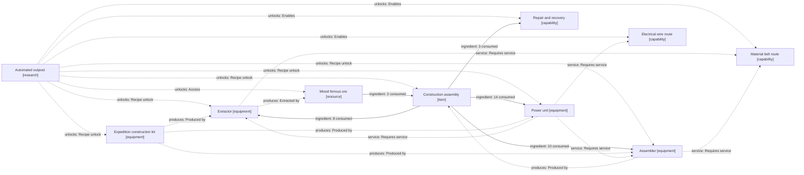

| Unlock | Type / status | Exact recipe or acquisition | Producer | Operating requirements |
| --- | --- | --- | --- | --- |
| Expedition construction kit | equipment / current | Supplied with the expedition | — | Starting capability; consumes listed construction materials instantly. Not a craftable machine. |
| Mixed ferrous ore | resource / current | Extract from a finite deposit | Extractor | Finite starter/remote deposits; extractor produces one ore every 0.65 s with 8 power. Belt output. |
| Construction assembly | item / current | 2 Mixed ferrous ore → 1 Construction assembly / 1.4 s | Assembler | Consume the listed inputs once per completed recipe. |
| Extractor | equipment / current | 8 Construction assembly → 1 Extractor · build instantly | Expedition construction kit | 8 power; place on a deposit. 1 ore / 0.65 s; belt output. New mineral types are proposed. Requires: Power unit. |
| Assembler | equipment / current | 10 Construction assembly → 1 Assembler · build instantly | Expedition construction kit | 6 power; 2 ore → 1 assembly / 1.4 s. Starter machine is already built. Requires: Power unit. |
| Power unit | equipment / current | 14 Construction assembly → 1 Power unit · build instantly | Expedition construction kit | 240 power units per generator; connect a wire to each active load. Fuel abstracted. |
| Material belt route | capability / current | Operating capability / milestone | — | Existing free material routes: 2 tiles/s, spacing and backpressure. Requires: Extractor, Assembler. |
| Electrical wire route | capability / current | Operating capability / milestone | — | Existing free point-to-point wires; 240-unit generator capacity. Requires: Power unit. |
| Repair and recovery | capability / current | 3 Construction assembly → 1 Repair and recovery · build instantly | — | Each manual repair consumes 3 assemblies. Recovery returns an intact machine’s existing construction cost. |

## Field engineering

**Research prerequisites:** Automated outpost. **Cost:** Expedition equipment.

Included with every expedition.

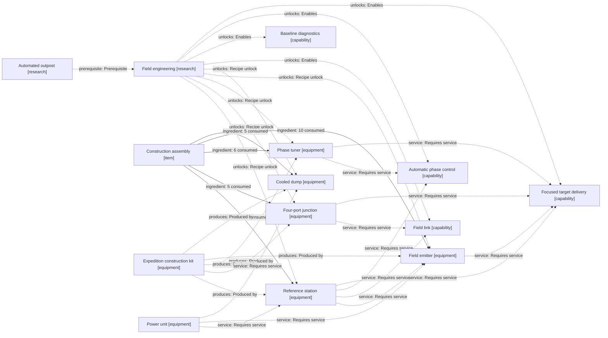

| Unlock | Type / status | Exact recipe or acquisition | Producer | Operating requirements |
| --- | --- | --- | --- | --- |
| Reference station | equipment / current | 12 Construction assembly → 1 Reference station · build instantly | Expedition construction kit | 125 power → 100 field units; coherent reference OUT. Requires: Power unit. |
| Four-port junction | equipment / current | 5 Construction assembly → 1 Four-port junction · build instantly | Expedition construction kit | Passive four-port splitter/combiner; terminate unused ports. |
| Phase tuner | equipment / current | 6 Construction assembly → 1 Phase tuner · build instantly | Expedition construction kit | Passive ±180° trim; thermal drift changes phase. |
| Field emitter | equipment / current | 10 Construction assembly → 1 Field emitter · build instantly | Expedition construction kit | 4 power and field input; directs useful power toward the guardian. Requires: Power unit, Reference station. |
| Cooled dump | equipment / current | 5 Construction assembly → 1 Cooled dump · build instantly | Expedition construction kit | 2 cooling power; absorbs rejected field, trips at 85 °C. Requires: Power unit. |
| Field link | capability / current | Operating capability / milestone | — | Existing free field routes. Length and bends affect phase, attenuation and radiation. Requires: Reference station, Four-port junction. |
| Baseline diagnostics | capability / current | Operating capability / milestone | — | Available from the start: faults, remedies, energy balance and object location. |
| Automatic phase control | capability / current | Operating capability / milestone | — | Bounded phase search follows thermal drift. No extra research lock in the starter scenario. Requires: Reference station, Phase tuner. |
| Focused target delivery | capability / current | Operating capability / milestone | — | Two powered emitter branches plus phase trim can exceed 32 useful units; this is a measured output, not an inventory item. Requires: Reference station, Four-port junction, Phase tuner, Field emitter. |

## Perimeter defense

**Research prerequisites:** Automated outpost. **Cost:** Expedition equipment.

Available immediately; wire a sentry to activate the existing defense gate.

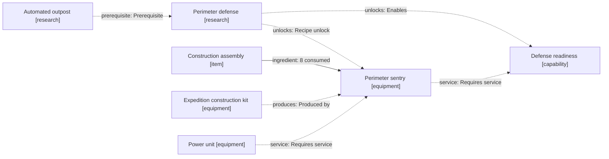

| Unlock | Type / status | Exact recipe or acquisition | Producer | Operating requirements |
| --- | --- | --- | --- | --- |
| Perimeter sentry | equipment / current | 8 Construction assembly → 1 Perimeter sentry · build instantly | Expedition construction kit | 6 wired power; 8-tile defense radius; ammunition abstracted for this original model. Requires: Power unit. |
| Defense readiness | capability / current | Operating capability / milestone | — | First powered sentry starts a 30-second grace period. It enables the existing wildlife-aggression gate. Requires: Perimeter sentry. |

## Open the frontier

**Research prerequisites:** Field engineering. **Cost:** Gameplay milestone · no research cost.

Clear the guardian by delivering more than 32 on-target field units.

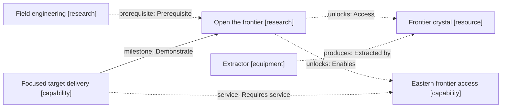

| Unlock | Type / status | Exact recipe or acquisition | Producer | Operating requirements |
| --- | --- | --- | --- | --- |
| Frontier crystal | resource / current | Extract from a finite deposit | Extractor | Clear the guardian, build an extractor over the deposit and supply 8 power. Crystal enters shared stock. |
| Eastern frontier access | capability / current | Operating capability / milestone | — | Guardian defeated: access the eastern sector and crystal deposit. Requires: Focused target delivery. |

## First crystal

**Research prerequisites:** Open the frontier. **Cost:** Gameplay milestone · no research cost.

Harvest at least 1 crystal using a powered extractor over the frontier deposit.

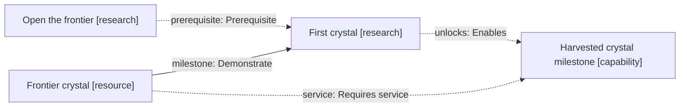

| Unlock | Type / status | Exact recipe or acquisition | Producer | Operating requirements |
| --- | --- | --- | --- | --- |
| Harvested crystal milestone | capability / current | Operating capability / milestone | — | Observe the first harvested crystal. Proposed permanent milestone history survives later spending. Requires: Frontier crystal. |

## Qualified outpost

**Research prerequisites:** Open the frontier. **Cost:** Gameplay milestone · no research cost.

Enable automatic phase control and establish at least 35 target units to start. Sustain at least 32 units for the 20-second drift test with no trips or destroyed equipment, then record a blueprint. Every placed installation needs local qualification.

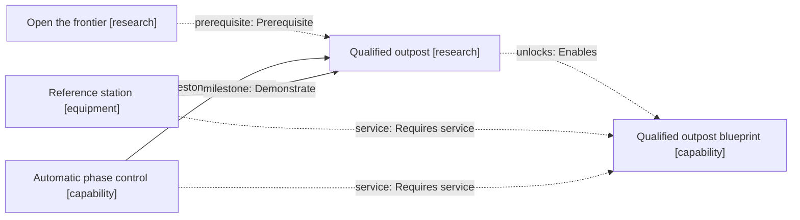

| Unlock | Type / status | Exact recipe or acquisition | Producer | Operating requirements |
| --- | --- | --- | --- | --- |
| Qualified outpost blueprint | capability / current | Operating capability / milestone | — | Enable automatic control and reach 35 target units to begin. Hold at least 32 for 20 seconds with no trips or destroyed equipment, then record topology. Stamping costs the sum of its machines; every placement requires local qualification. Requires: Reference station, Automatic phase control. |

## Industrial research

**Research prerequisites:** First crystal + Qualified outpost. **Cost:** Project conditions.

First crystal and a qualified blueprint unlock the workbench and laboratory recipes immediately. Build and power these machines to begin pack-funded research; their construction needs no science packs.

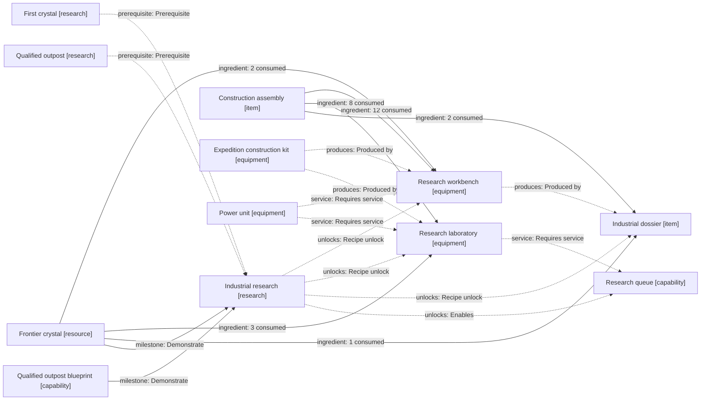

| Unlock | Type / status | Exact recipe or acquisition | Producer | Operating requirements |
| --- | --- | --- | --- | --- |
| Research workbench | equipment / proposed | 12 Construction assembly + 2 Frontier crystal → 1 Research workbench · build instantly | Expedition construction kit | 6 power; produces all unlocked dossier recipes. Requires: Power unit. |
| Research laboratory | equipment / proposed | 8 Construction assembly + 3 Frontier crystal → 1 Research laboratory · build instantly | Expedition construction kit | 12 power; consumes each required dossier per research unit, at one laboratory-second per simulated second. Requires: Power unit. |
| Industrial dossier | item / proposed | 2 Construction assembly + 1 Frontier crystal → 1 Industrial dossier / 4 s | Research workbench | Consume the listed inputs once per completed recipe. |
| Research queue | capability / proposed | Operating capability / milestone | — | One active technology across all supplied labs. Queue prerequisites, retain partial progress and show input shortages. Requires: Research laboratory. |

## Structured logistics

**Research prerequisites:** Industrial research. **Cost:** 40 × Industrial dossier · 10 s / unit.

Complete research in powered laboratories.

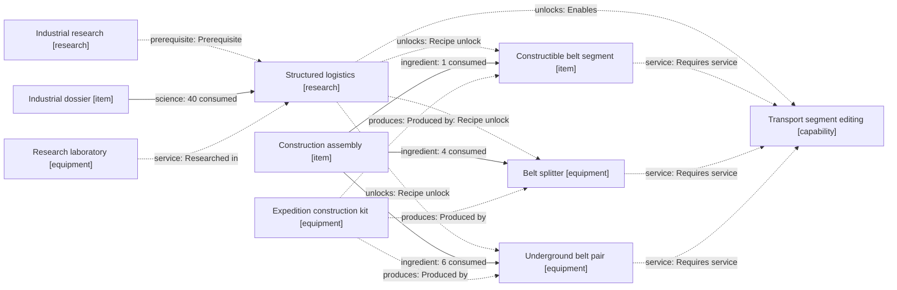

| Unlock | Type / status | Exact recipe or acquisition | Producer | Operating requirements |
| --- | --- | --- | --- | --- |
| Belt splitter | equipment / proposed | 4 Construction assembly → 1 Belt splitter · build instantly | Expedition construction kit | Passive 1:2 or 2:1 routing; priority selection and explicit throughput. |
| Underground belt pair | equipment / proposed | 6 Construction assembly → 1 Underground belt pair · build instantly | Expedition construction kit | One recipe builds a matched entry/exit pair; up to 6 tiles beneath crossings. |
| Constructible belt segment | item / proposed | 1 Construction assembly → 4 Constructible belt segment · construct instantly | Expedition construction kit | Consume the listed inputs once per completed recipe. |
| Transport segment editing | capability / proposed | Operating capability / milestone | — | Select and replace individual transport segments; show costs and preserve packet accounting. Requires: Constructible belt segment, Belt splitter, Underground belt pair. |

## Instrumented networks

**Research prerequisites:** Industrial research. **Cost:** 30 × Industrial dossier · 10 s / unit.

Complete research; baseline errors remain available from the start.

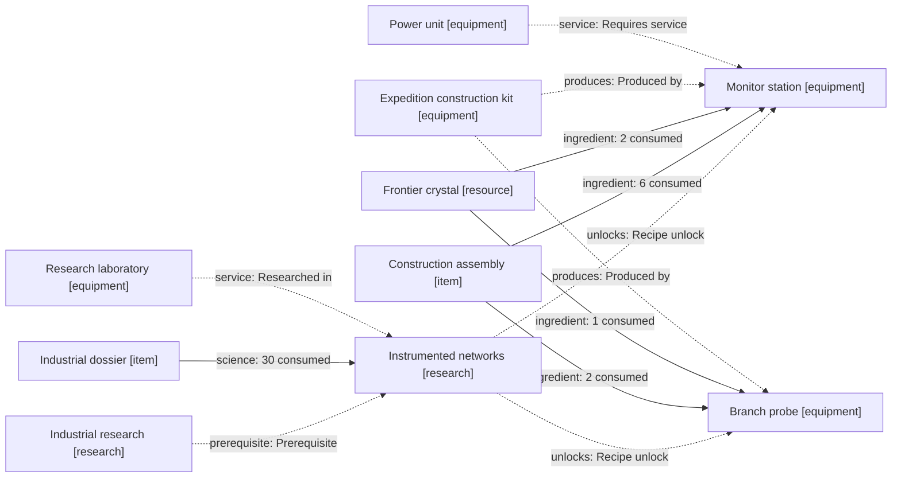

| Unlock | Type / status | Exact recipe or acquisition | Producer | Operating requirements |
| --- | --- | --- | --- | --- |
| Monitor station | equipment / proposed | 6 Construction assembly + 2 Frontier crystal → 1 Monitor station · build instantly | Expedition construction kit | 4 power; precise traces and history export. Basic faults stay visible without this equipment. Requires: Power unit. |
| Branch probe | equipment / proposed | 2 Construction assembly + 1 Frontier crystal → 1 Branch probe · build instantly | Expedition construction kit | Passive incident/return sample at a port; no hidden field energy gain. |

## Power distribution

**Research prerequisites:** Industrial research. **Cost:** 40 × Industrial dossier · 10 s / unit.

Complete research in powered laboratories.

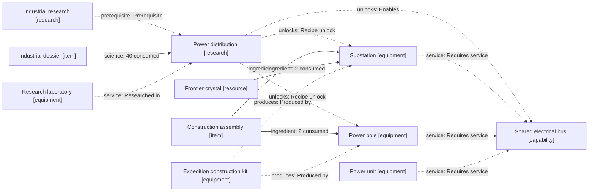

| Unlock | Type / status | Exact recipe or acquisition | Producer | Operating requirements |
| --- | --- | --- | --- | --- |
| Power pole | equipment / proposed | 2 Construction assembly → 1 Power pole · build instantly | Expedition construction kit | Passive electrical branch support; explicit network capacity. |
| Substation | equipment / proposed | 12 Construction assembly + 2 Frontier crystal → 1 Substation · build instantly | Expedition construction kit | Multi-generator bus with breaker-isolated load branches; 960-unit nominal throughput. |
| Shared electrical bus | capability / proposed | Operating capability / milestone | — | Aggregate supply by connected component; overload and islanding are visible faults. Requires: Substation, Power pole, Power unit. |

## Prepared materials

**Research prerequisites:** Industrial research. **Cost:** 50 × Industrial dossier · 10 s / unit.

Complete research; build a powered processor to make the new recipes.

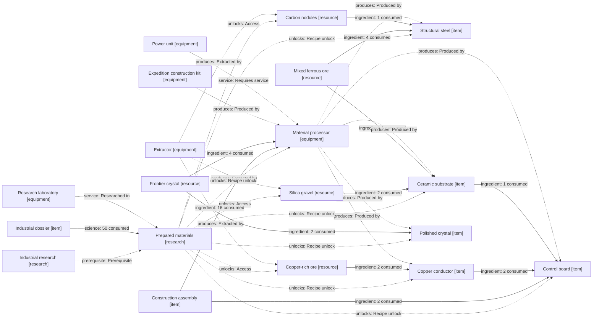

| Unlock | Type / status | Exact recipe or acquisition | Producer | Operating requirements |
| --- | --- | --- | --- | --- |
| Copper-rich ore | resource / proposed | Extract from a finite deposit | Extractor | Proposed guaranteed post-frontier surface deposit; mined by the existing extractor. No advanced transport needed. |
| Silica gravel | resource / proposed | Extract from a finite deposit | Extractor | Proposed guaranteed surface deposit within the first cleared sector; mined by extractor. |
| Carbon nodules | resource / proposed | Extract from a finite deposit | Extractor | Proposed guaranteed surface deposit within the first cleared sector; mined by extractor. |
| Material processor | equipment / proposed | 16 Construction assembly + 4 Frontier crystal → 1 Material processor · build instantly | Expedition construction kit | 12 power; one refining/chemical recipe at a time. Construction uses the starter supply chain. Requires: Power unit. |
| Structural steel | item / proposed | 4 Mixed ferrous ore + 1 Carbon nodules → 2 Structural steel / 4 s | Material processor | Consume the listed inputs once per completed recipe. |
| Copper conductor | item / proposed | 2 Copper-rich ore → 4 Copper conductor / 2 s | Material processor | Consume the listed inputs once per completed recipe. |
| Ceramic substrate | item / proposed | 2 Silica gravel + 1 Mixed ferrous ore → 2 Ceramic substrate / 4 s | Material processor | Consume the listed inputs once per completed recipe. |
| Polished crystal | item / proposed | 2 Frontier crystal → 1 Polished crystal / 4 s | Material processor | Consume the listed inputs once per completed recipe. |
| Control board | item / proposed | 2 Construction assembly + 2 Copper conductor + 1 Ceramic substrate → 1 Control board / 6 s | Material processor | Consume the listed inputs once per completed recipe. |

## Modular construction

**Research prerequisites:** Structured logistics + Qualified outpost + Prepared materials. **Cost:** 60 × Industrial dossier · 15 s / unit.

Complete research; local qualification remains mandatory.

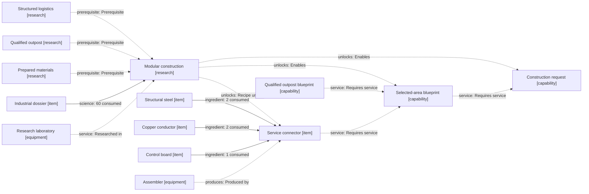

| Unlock | Type / status | Exact recipe or acquisition | Producer | Operating requirements |
| --- | --- | --- | --- | --- |
| Service connector | item / proposed | 2 Structural steel + 2 Copper conductor + 1 Control board → 1 Service connector / 4 s | Assembler | Consume the listed inputs once per completed recipe. |
| Selected-area blueprint | capability / proposed | Operating capability / milestone | — | Capture a chosen cell and its declared service connectors rather than the whole outpost. Requires: Qualified outpost blueprint, Service connector. |
| Construction request | capability / proposed | Operating capability / milestone | — | Display a bill of materials and place requested components using the construction kit. No unimplemented robots implied. Requires: Selected-area blueprint. |

## Thermal management

**Research prerequisites:** Instrumented networks + Prepared materials. **Cost:** 40 × Industrial dossier · 15 s / unit.

Complete research in powered laboratories.

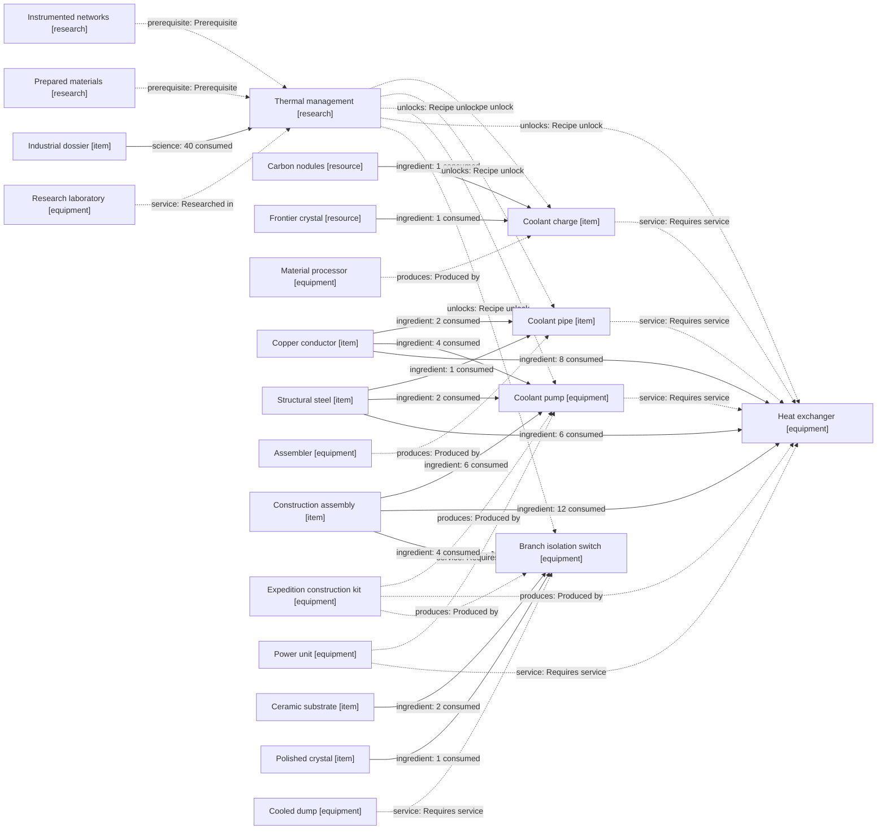

| Unlock | Type / status | Exact recipe or acquisition | Producer | Operating requirements |
| --- | --- | --- | --- | --- |
| Coolant charge | item / proposed | 1 Carbon nodules + 1 Frontier crystal → 4 Coolant charge / 4 s | Material processor | Consume the listed inputs once per completed recipe. |
| Coolant pipe | item / proposed | 2 Copper conductor + 1 Structural steel → 4 Coolant pipe / 2 s | Assembler | Consume the listed inputs once per completed recipe. |
| Coolant pump | equipment / proposed | 6 Construction assembly + 2 Structural steel + 4 Copper conductor → 1 Coolant pump · build instantly | Expedition construction kit | 4 power; moves coolant around a closed loop. Requires: Power unit. |
| Heat exchanger | equipment / proposed | 12 Construction assembly + 6 Structural steel + 8 Copper conductor → 1 Heat exchanger · build instantly | Expedition construction kit | 8 power; rejects loop heat. Connect pump, pipes and at least 4 coolant charges. Requires: Power unit, Coolant pump, Coolant pipe, Coolant charge. |
| Branch isolation switch | equipment / proposed | 4 Construction assembly + 2 Ceramic substrate + 1 Polished crystal → 1 Branch isolation switch · build instantly | Expedition construction kit | Trips a branch on return power/heat; isolation redirects energy to a matched dump. Requires: Cooled dump. |

## Layered defenses

**Research prerequisites:** Power distribution + Perimeter defense + Prepared materials. **Cost:** 40 × Industrial dossier · 15 s / unit.

Complete research; the initial sentry retains its prototype service contract. Upgraded sentries consume magazines.

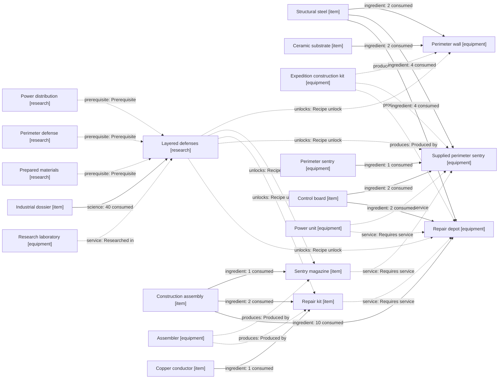

| Unlock | Type / status | Exact recipe or acquisition | Producer | Operating requirements |
| --- | --- | --- | --- | --- |
| Perimeter wall | equipment / proposed | 2 Structural steel + 2 Ceramic substrate → 1 Perimeter wall · build instantly | Expedition construction kit | Passive barrier; gates and routing clearances remain explicit. |
| Sentry magazine | item / proposed | 1 Construction assembly → 4 Sentry magazine / 4 s | Assembler | Consume the listed inputs once per completed recipe. |
| Repair kit | item / proposed | 2 Construction assembly + 1 Copper conductor → 1 Repair kit / 4 s | Assembler | Consume the listed inputs once per completed recipe. |
| Supplied perimeter sentry | equipment / proposed | 1 Perimeter sentry + 4 Structural steel + 2 Control board → 1 Supplied perimeter sentry · build instantly | Expedition construction kit | 8 power; magazine-fed upgrade. Building consumes one recovered original sentry and the listed parts. Requires: Power unit, Sentry magazine. |
| Repair depot | equipment / proposed | 10 Construction assembly + 4 Structural steel + 2 Control board → 1 Repair depot · build instantly | Expedition construction kit | 8 power; restores nearby damaged equipment by consuming repair kits. Requires: Power unit, Repair kit. |

## Precision research

**Research prerequisites:** Prepared materials + Instrumented networks. **Cost:** 60 × Industrial dossier · 15 s / unit.

Complete industrial research, then feed boards and polished crystal to the research workbench.

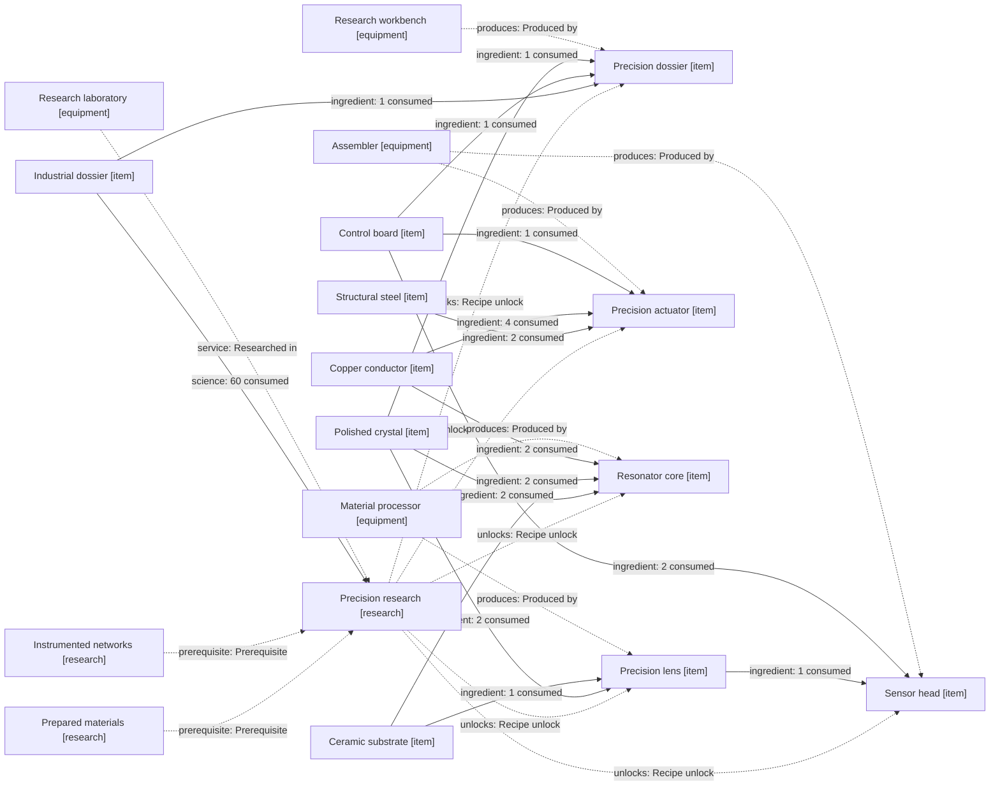

| Unlock | Type / status | Exact recipe or acquisition | Producer | Operating requirements |
| --- | --- | --- | --- | --- |
| Precision dossier | item / proposed | 1 Industrial dossier + 1 Control board + 1 Polished crystal → 1 Precision dossier / 6 s | Research workbench | Consume the listed inputs once per completed recipe. |
| Precision lens | item / proposed | 2 Polished crystal + 1 Ceramic substrate → 1 Precision lens / 6 s | Material processor | Consume the listed inputs once per completed recipe. |
| Precision actuator | item / proposed | 2 Structural steel + 4 Copper conductor + 1 Control board → 1 Precision actuator / 6 s | Assembler | Consume the listed inputs once per completed recipe. |
| Resonator core | item / proposed | 2 Polished crystal + 2 Ceramic substrate + 2 Copper conductor → 1 Resonator core / 8 s | Material processor | Consume the listed inputs once per completed recipe. |
| Sensor head | item / proposed | 1 Precision lens + 2 Control board → 1 Sensor head / 6 s | Assembler | Consume the listed inputs once per completed recipe. |

## Long-range transport

**Research prerequisites:** Modular construction + Power distribution + Precision research. **Cost:** 80 × Industrial dossier + Precision dossier · 20 s / unit.

Complete research; conduit behavior uses declared loss and bend specifications.

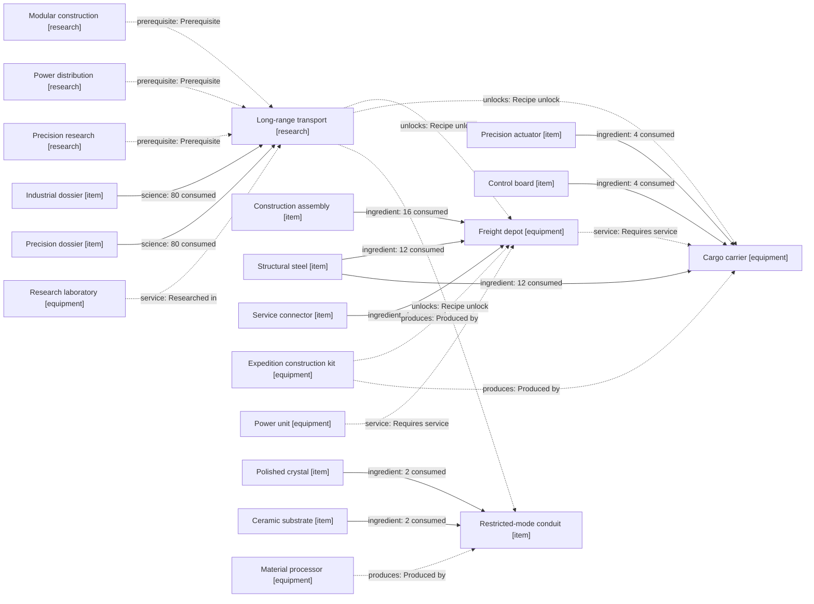

| Unlock | Type / status | Exact recipe or acquisition | Producer | Operating requirements |
| --- | --- | --- | --- | --- |
| Freight depot | equipment / proposed | 16 Construction assembly + 12 Structural steel + 4 Service connector → 1 Freight depot · build instantly | Expedition construction kit | 12 power; buffers items and dispatches scheduled carriers. Requires: Power unit. |
| Cargo carrier | equipment / proposed | 12 Structural steel + 4 Precision actuator + 4 Control board → 1 Cargo carrier · build instantly | Expedition construction kit | Battery-powered vehicle charged at the depot. Capacity 40 item stacks; schedules use explicit loading conditions. Requires: Freight depot. |
| Restricted-mode conduit | item / proposed | 2 Polished crystal + 2 Ceramic substrate → 4 Restricted-mode conduit / 6 s | Material processor | Consume the listed inputs once per completed recipe. |

## Stable source arrays

**Research prerequisites:** Precision research + Thermal management. **Cost:** 80 × Industrial dossier + Precision dossier · 20 s / unit.

Complete research; each source must meet its locking and thermal limits.

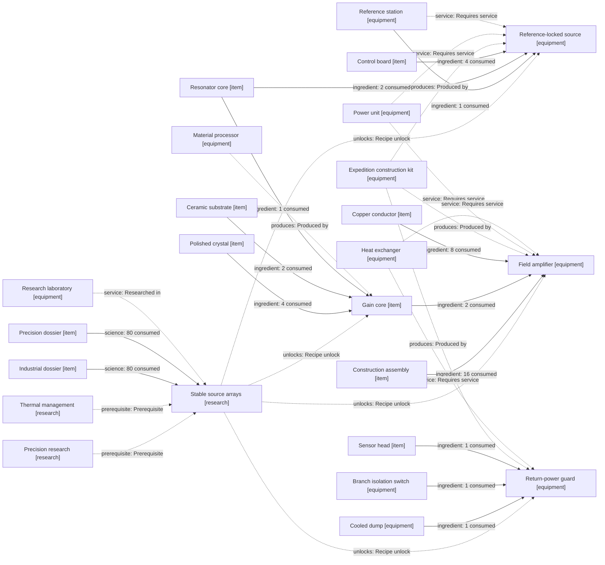

| Unlock | Type / status | Exact recipe or acquisition | Producer | Operating requirements |
| --- | --- | --- | --- | --- |
| Reference-locked source | equipment / proposed | 1 Reference station + 2 Resonator core + 4 Control board → 1 Reference-locked source · build instantly | Expedition construction kit | 160 power; upgraded source locks to a reference and reports lock margin. Recovered reference station is consumed. Requires: Power unit, Reference station. |
| Gain core | item / proposed | 4 Polished crystal + 2 Ceramic substrate + 1 Resonator core → 1 Gain core / 10 s | Material processor | Consume the listed inputs once per completed recipe. |
| Field amplifier | equipment / proposed | 16 Construction assembly + 2 Gain core + 8 Copper conductor → 1 Field amplifier · build instantly | Expedition construction kit | 80 power plus field input and cooling; adds field energy through an explicit ledger. Requires: Power unit, Heat exchanger. |
| Return-power guard | equipment / proposed | 1 Cooled dump + 1 Branch isolation switch + 1 Sensor head → 1 Return-power guard · build instantly | Expedition construction kit | Dump-backed return protection; directed rejected energy is still accounted as heat. Requires: Heat exchanger. |

## Pulsed field delivery

**Research prerequisites:** Layered defenses + Thermal management + Precision research. **Cost:** 80 × Industrial dossier + Precision dossier · 20 s / unit.

Complete research; entering the next sector introduces the new threat after defense is available.

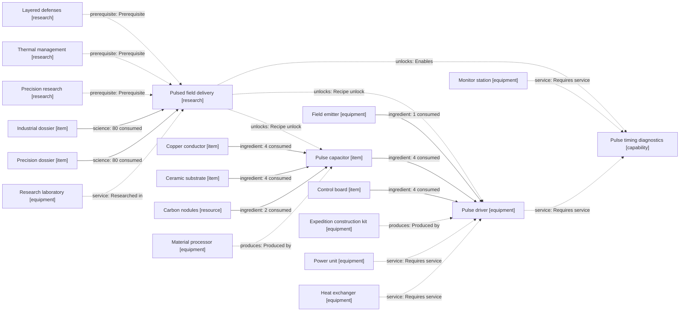

| Unlock | Type / status | Exact recipe or acquisition | Producer | Operating requirements |
| --- | --- | --- | --- | --- |
| Pulse capacitor | item / proposed | 4 Copper conductor + 4 Ceramic substrate + 2 Carbon nodules → 1 Pulse capacitor / 8 s | Material processor | Consume the listed inputs once per completed recipe. |
| Pulse driver | equipment / proposed | 1 Field emitter + 4 Pulse capacitor + 4 Control board → 1 Pulse driver · build instantly | Expedition construction kit | 40 power while charging; existing emitter body becomes a pulse-delivery device. Requires: Power unit, Heat exchanger. |
| Pulse timing diagnostics | capability / proposed | Operating capability / milestone | — | Read delivered pulse energy, peak power, duty cycle and thermal limits. Requires: Monitor station, Pulse driver. |

## Precision fabrication

**Research prerequisites:** Precision research + Modular construction + Thermal management. **Cost:** 100 × Industrial dossier + Precision dossier · 20 s / unit.

Complete research; only parts that pass the cell inspection count as accepted output.

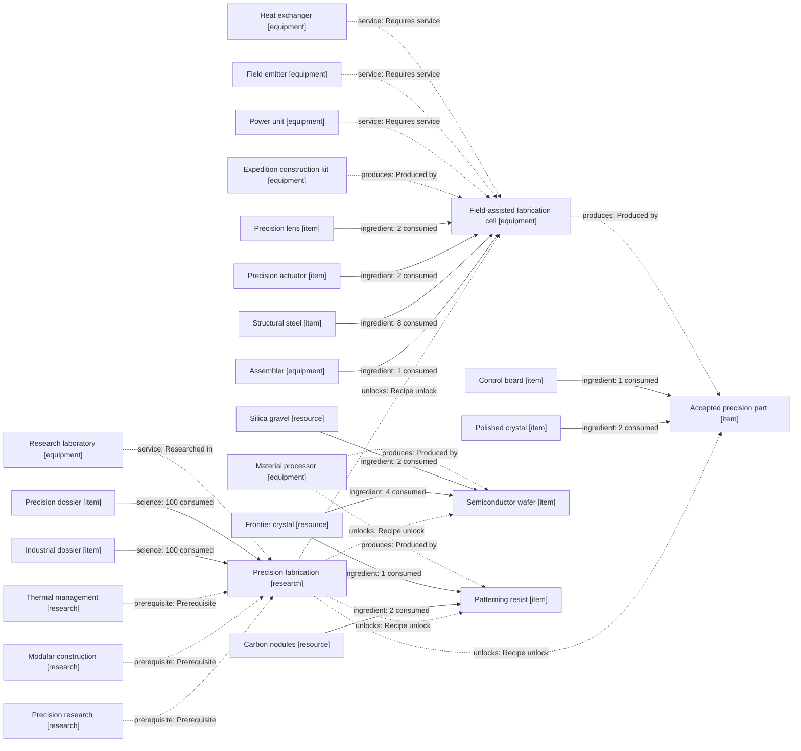

| Unlock | Type / status | Exact recipe or acquisition | Producer | Operating requirements |
| --- | --- | --- | --- | --- |
| Field-assisted fabrication cell | equipment / proposed | 1 Assembler + 8 Structural steel + 2 Precision actuator + 2 Precision lens → 1 Field-assisted fabrication cell · build instantly | Expedition construction kit | 24 power plus ≥10 stable useful process-field units and cooling for accepted precision parts. Starter reference/emitter can supply this contract. Requires: Power unit, Field emitter, Heat exchanger. |
| Accepted precision part | item / proposed | 2 Polished crystal + 1 Control board → 1 Accepted precision part / 8 s | Field-assisted fabrication cell | Consume the listed inputs once per completed recipe. |
| Semiconductor wafer | item / proposed | 4 Frontier crystal + 2 Silica gravel → 2 Semiconductor wafer / 8 s | Material processor | Consume the listed inputs once per completed recipe. |
| Patterning resist | item / proposed | 2 Carbon nodules + 1 Frontier crystal → 4 Patterning resist / 4 s | Material processor | Consume the listed inputs once per completed recipe. |

## Integrated photonics

**Research prerequisites:** Stable source arrays + Precision fabrication. **Cost:** 120 × Industrial dossier + Precision dossier · 25 s / unit.

Complete research; produce accepted precision parts and photonic modules before making systems dossiers.

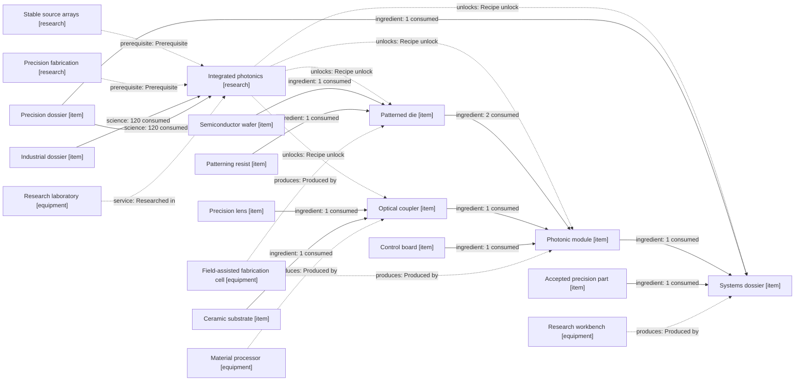

| Unlock | Type / status | Exact recipe or acquisition | Producer | Operating requirements |
| --- | --- | --- | --- | --- |
| Patterned die | item / proposed | 1 Semiconductor wafer + 1 Patterning resist → 4 Patterned die / 10 s | Field-assisted fabrication cell | Consume the listed inputs once per completed recipe. |
| Optical coupler | item / proposed | 1 Precision lens + 1 Ceramic substrate → 2 Optical coupler / 6 s | Material processor | Consume the listed inputs once per completed recipe. |
| Photonic module | item / proposed | 2 Patterned die + 1 Optical coupler + 1 Control board → 1 Photonic module / 8 s | Field-assisted fabrication cell | Consume the listed inputs once per completed recipe. |
| Systems dossier | item / proposed | 1 Precision dossier + 1 Photonic module + 1 Accepted precision part → 1 Systems dossier / 10 s | Research workbench | Consume the listed inputs once per completed recipe. |

## Distributed infrastructure

**Research prerequisites:** Long-range transport + Integrated photonics. **Cost:** 160 × Industrial dossier + Precision dossier + Systems dossier · 30 s / unit.

Complete research; communication quality constrains remote automation.

```mermaid
flowchart LR
  tech_transport["Long-range transport [research]"]
  tech_distributed["Distributed infrastructure [research]"]
  tech_photonics["Integrated photonics [research]"]
  product_industrial_dossier["Industrial dossier [item]"]
  product_precision_dossier["Precision dossier [item]"]
  product_systems_dossier["Systems dossier [item]"]
  product_laboratory["Research laboratory [equipment]"]
  product_communication_module["Communication module [item]"]
  product_photonic_module["Photonic module [item]"]
  product_control_board["Control board [item]"]
  product_fabrication_cell["Field-assisted fabrication cell [equipment]"]
  product_relay["Communication relay [equipment]"]
  product_steel["Structural steel [item]"]
  product_actuator["Precision actuator [item]"]
  product_construction["Expedition construction kit [equipment]"]
  product_generator["Power unit [equipment]"]
  product_regional_controller["Regional scheduler [equipment]"]
  product_assembly["Construction assembly [item]"]
  product_freight_depot["Freight depot [equipment]"]
  tech_transport -.->|"prerequisite: Prerequisite"| tech_distributed
  tech_photonics -.->|"prerequisite: Prerequisite"| tech_distributed
  product_industrial_dossier -->|"science: 160 consumed"| tech_distributed
  product_precision_dossier -->|"science: 160 consumed"| tech_distributed
  product_systems_dossier -->|"science: 160 consumed"| tech_distributed
  product_laboratory -.->|"service: Researched in"| tech_distributed
  tech_distributed -.->|"unlocks: Recipe unlock"| product_communication_module
  product_photonic_module -->|"ingredient: 2 consumed"| product_communication_module
  product_control_board -->|"ingredient: 2 consumed"| product_communication_module
  product_fabrication_cell -.->|"produces: Produced by"| product_communication_module
  tech_distributed -.->|"unlocks: Recipe unlock"| product_relay
  product_steel -->|"ingredient: 8 consumed"| product_relay
  product_communication_module -->|"ingredient: 2 consumed"| product_relay
  product_actuator -->|"ingredient: 1 consumed"| product_relay
  product_construction -.->|"produces: Produced by"| product_relay
  product_generator -.->|"service: Requires service"| product_relay
  tech_distributed -.->|"unlocks: Recipe unlock"| product_regional_controller
  product_assembly -->|"ingredient: 12 consumed"| product_regional_controller
  product_control_board -->|"ingredient: 4 consumed"| product_regional_controller
  product_communication_module -->|"ingredient: 2 consumed"| product_regional_controller
  product_construction -.->|"produces: Produced by"| product_regional_controller
  product_generator -.->|"service: Requires service"| product_regional_controller
  product_relay -.->|"service: Requires service"| product_regional_controller
  product_freight_depot -.->|"service: Requires service"| product_regional_controller
```

| Unlock | Type / status | Exact recipe or acquisition | Producer | Operating requirements |
| --- | --- | --- | --- | --- |
| Communication module | item / proposed | 2 Photonic module + 2 Control board → 1 Communication module / 8 s | Field-assisted fabrication cell | Consume the listed inputs once per completed recipe. |
| Communication relay | equipment / proposed | 8 Structural steel + 2 Communication module + 1 Precision actuator → 1 Communication relay · build instantly | Expedition construction kit | 12 power; transports commands and telemetry with finite delay. Requires: Power unit. |
| Regional scheduler | equipment / proposed | 12 Construction assembly + 4 Control board + 2 Communication module → 1 Regional scheduler · build instantly | Expedition construction kit | 12 power; coordinates depot schedules across linked regions. Requires: Power unit, Communication relay, Freight depot. |

## Adaptive aperture control

**Research prerequisites:** Integrated photonics + Instrumented networks. **Cost:** 160 × Industrial dossier + Precision dossier + Systems dossier · 30 s / unit.

Complete research; each sector performs a local calibration before joining an aperture.

```mermaid
flowchart LR
  tech_photonics["Integrated photonics [research]"]
  tech_adaptive["Adaptive aperture control [research]"]
  tech_instrumentation["Instrumented networks [research]"]
  product_industrial_dossier["Industrial dossier [item]"]
  product_precision_dossier["Precision dossier [item]"]
  product_systems_dossier["Systems dossier [item]"]
  product_laboratory["Research laboratory [equipment]"]
  product_calibration_beacon["Calibration beacon [equipment]"]
  product_sensor["Sensor head [item]"]
  product_photonic_module["Photonic module [item]"]
  product_steel["Structural steel [item]"]
  product_construction["Expedition construction kit [equipment]"]
  product_generator["Power unit [equipment]"]
  product_sector_controller["Aperture sector controller [equipment]"]
  product_control_board["Control board [item]"]
  tech_photonics -.->|"prerequisite: Prerequisite"| tech_adaptive
  tech_instrumentation -.->|"prerequisite: Prerequisite"| tech_adaptive
  product_industrial_dossier -->|"science: 160 consumed"| tech_adaptive
  product_precision_dossier -->|"science: 160 consumed"| tech_adaptive
  product_systems_dossier -->|"science: 160 consumed"| tech_adaptive
  product_laboratory -.->|"service: Researched in"| tech_adaptive
  tech_adaptive -.->|"unlocks: Recipe unlock"| product_calibration_beacon
  product_sensor -->|"ingredient: 2 consumed"| product_calibration_beacon
  product_photonic_module -->|"ingredient: 2 consumed"| product_calibration_beacon
  product_steel -->|"ingredient: 4 consumed"| product_calibration_beacon
  product_construction -.->|"produces: Produced by"| product_calibration_beacon
  product_generator -.->|"service: Requires service"| product_calibration_beacon
  tech_adaptive -.->|"unlocks: Recipe unlock"| product_sector_controller
  product_control_board -->|"ingredient: 6 consumed"| product_sector_controller
  product_photonic_module -->|"ingredient: 4 consumed"| product_sector_controller
  product_sensor -->|"ingredient: 2 consumed"| product_sector_controller
  product_construction -.->|"produces: Produced by"| product_sector_controller
  product_generator -.->|"service: Requires service"| product_sector_controller
  product_calibration_beacon -.->|"service: Requires service"| product_sector_controller
```

| Unlock | Type / status | Exact recipe or acquisition | Producer | Operating requirements |
| --- | --- | --- | --- | --- |
| Calibration beacon | equipment / proposed | 2 Sensor head + 2 Photonic module + 4 Structural steel → 1 Calibration beacon · build instantly | Expedition construction kit | 8 power; provides a surveyed field calibration target. Requires: Power unit. |
| Aperture sector controller | equipment / proposed | 6 Control board + 4 Photonic module + 2 Sensor head → 1 Aperture sector controller · build instantly | Expedition construction kit | 20 power; bounds adaptive phase updates using beacon feedback. Requires: Power unit, Calibration beacon. |

## Frontier observatories

**Research prerequisites:** Pulsed field delivery + Integrated photonics. **Cost:** 140 × Industrial dossier + Precision dossier + Systems dossier · 30 s / unit.

Complete research, then operate powered observatories to obtain site and target data.

```mermaid
flowchart LR
  tech_pulses["Pulsed field delivery [research]"]
  tech_survey["Frontier observatories [research]"]
  tech_photonics["Integrated photonics [research]"]
  product_industrial_dossier["Industrial dossier [item]"]
  product_precision_dossier["Precision dossier [item]"]
  product_systems_dossier["Systems dossier [item]"]
  product_laboratory["Research laboratory [equipment]"]
  product_observatory["Frontier observatory [equipment]"]
  product_steel["Structural steel [item]"]
  product_precision_lens["Precision lens [item]"]
  product_sensor["Sensor head [item]"]
  product_actuator["Precision actuator [item]"]
  product_construction["Expedition construction kit [equipment]"]
  product_generator["Power unit [equipment]"]
  product_tracking_receiver["Tracking receiver [equipment]"]
  product_photonic_module["Photonic module [item]"]
  product_site_survey["Surveyed aperture site [capability]"]
  tech_pulses -.->|"prerequisite: Prerequisite"| tech_survey
  tech_photonics -.->|"prerequisite: Prerequisite"| tech_survey
  product_industrial_dossier -->|"science: 140 consumed"| tech_survey
  product_precision_dossier -->|"science: 140 consumed"| tech_survey
  product_systems_dossier -->|"science: 140 consumed"| tech_survey
  product_laboratory -.->|"service: Researched in"| tech_survey
  tech_survey -.->|"unlocks: Recipe unlock"| product_observatory
  product_steel -->|"ingredient: 16 consumed"| product_observatory
  product_precision_lens -->|"ingredient: 4 consumed"| product_observatory
  product_sensor -->|"ingredient: 4 consumed"| product_observatory
  product_actuator -->|"ingredient: 2 consumed"| product_observatory
  product_construction -.->|"produces: Produced by"| product_observatory
  product_generator -.->|"service: Requires service"| product_observatory
  tech_survey -.->|"unlocks: Recipe unlock"| product_tracking_receiver
  product_sensor -->|"ingredient: 2 consumed"| product_tracking_receiver
  product_photonic_module -->|"ingredient: 2 consumed"| product_tracking_receiver
  product_actuator -->|"ingredient: 2 consumed"| product_tracking_receiver
  product_construction -.->|"produces: Produced by"| product_tracking_receiver
  product_generator -.->|"service: Requires service"| product_tracking_receiver
  product_observatory -.->|"service: Requires service"| product_tracking_receiver
  tech_survey -.->|"unlocks: Enables"| product_site_survey
  product_observatory -.->|"service: Requires service"| product_site_survey
```

| Unlock | Type / status | Exact recipe or acquisition | Producer | Operating requirements |
| --- | --- | --- | --- | --- |
| Frontier observatory | equipment / proposed | 16 Structural steel + 4 Precision lens + 4 Sensor head + 2 Precision actuator → 1 Frontier observatory · build instantly | Expedition construction kit | 20 power; surveys build corridors and measures a target trajectory. Requires: Power unit. |
| Tracking receiver | equipment / proposed | 2 Sensor head + 2 Photonic module + 2 Precision actuator → 1 Tracking receiver · build instantly | Expedition construction kit | 12 power; live trajectory corrections and stale-data alarms. Requires: Power unit, Frontier observatory. |
| Surveyed aperture site | capability / proposed | Operating capability / milestone | — | One observatory survey certifies an unobstructed site. Certification is invalidated by incompatible construction; it is not a consumable item. Requires: Frontier observatory. |

## Large-area nanofabrication

**Research prerequisites:** Integrated photonics + Precision fabrication. **Cost:** 180 × Industrial dossier + Precision dossier + Systems dossier · 30 s / unit.

Complete research; defects reduce accepted film yield.

```mermaid
flowchart LR
  tech_photonics["Integrated photonics [research]"]
  tech_nanofab["Large-area nanofabrication [research]"]
  tech_fabrication["Precision fabrication [research]"]
  product_industrial_dossier["Industrial dossier [item]"]
  product_precision_dossier["Precision dossier [item]"]
  product_systems_dossier["Systems dossier [item]"]
  product_laboratory["Research laboratory [equipment]"]
  product_membrane_line["Membrane deposition line [equipment]"]
  product_steel["Structural steel [item]"]
  product_actuator["Precision actuator [item]"]
  product_photonic_module["Photonic module [item]"]
  product_accepted_part["Accepted precision part [item]"]
  product_construction["Expedition construction kit [equipment]"]
  product_generator["Power unit [equipment]"]
  product_emitter["Field emitter [equipment]"]
  product_heat_exchanger["Heat exchanger [equipment]"]
  product_metrology_gantry["Metrology gantry [equipment]"]
  product_sensor["Sensor head [item]"]
  product_sail_panel["Accepted sail panel [item]"]
  tech_photonics -.->|"prerequisite: Prerequisite"| tech_nanofab
  tech_fabrication -.->|"prerequisite: Prerequisite"| tech_nanofab
  product_industrial_dossier -->|"science: 180 consumed"| tech_nanofab
  product_precision_dossier -->|"science: 180 consumed"| tech_nanofab
  product_systems_dossier -->|"science: 180 consumed"| tech_nanofab
  product_laboratory -.->|"service: Researched in"| tech_nanofab
  tech_nanofab -.->|"unlocks: Recipe unlock"| product_membrane_line
  product_steel -->|"ingredient: 20 consumed"| product_membrane_line
  product_actuator -->|"ingredient: 4 consumed"| product_membrane_line
  product_photonic_module -->|"ingredient: 4 consumed"| product_membrane_line
  product_accepted_part -->|"ingredient: 8 consumed"| product_membrane_line
  product_construction -.->|"produces: Produced by"| product_membrane_line
  product_generator -.->|"service: Requires service"| product_membrane_line
  product_emitter -.->|"service: Requires service"| product_membrane_line
  product_heat_exchanger -.->|"service: Requires service"| product_membrane_line
  tech_nanofab -.->|"unlocks: Recipe unlock"| product_metrology_gantry
  product_steel -->|"ingredient: 12 consumed"| product_metrology_gantry
  product_sensor -->|"ingredient: 4 consumed"| product_metrology_gantry
  product_actuator -->|"ingredient: 2 consumed"| product_metrology_gantry
  product_photonic_module -->|"ingredient: 2 consumed"| product_metrology_gantry
  product_construction -.->|"produces: Produced by"| product_metrology_gantry
  product_generator -.->|"service: Requires service"| product_metrology_gantry
  tech_nanofab -.->|"unlocks: Recipe unlock"| product_sail_panel
  product_accepted_part -->|"ingredient: 2 consumed"| product_sail_panel
  product_photonic_module -->|"ingredient: 1 consumed"| product_sail_panel
  product_membrane_line -.->|"produces: Produced by"| product_sail_panel
  product_metrology_gantry -.->|"service: Requires service"| product_sail_panel
```

| Unlock | Type / status | Exact recipe or acquisition | Producer | Operating requirements |
| --- | --- | --- | --- | --- |
| Membrane deposition line | equipment / proposed | 20 Structural steel + 4 Precision actuator + 4 Photonic module + 8 Accepted precision part → 1 Membrane deposition line · build instantly | Expedition construction kit | 48 power, process field and cooling; produces film panels with counted rejects. Requires: Power unit, Field emitter, Heat exchanger. |
| Metrology gantry | equipment / proposed | 12 Structural steel + 4 Sensor head + 2 Precision actuator + 2 Photonic module → 1 Metrology gantry · build instantly | Expedition construction kit | 16 power; inspects membrane output. Uninspected film cannot fund a flight sail. Requires: Power unit. |
| Accepted sail panel | item / proposed | 2 Accepted precision part + 1 Photonic module → 1 Accepted sail panel / 12 s | Membrane deposition line | Consume the listed inputs once per completed recipe. Requires: Metrology gantry. |

## Planetary aperture

**Research prerequisites:** Distributed infrastructure + Adaptive aperture control + Frontier observatories. **Cost:** 250 × Industrial dossier + Precision dossier + Systems dossier · 30 s / unit.

Complete research; commission 4 sectors at surveyed sites, each at ≥100 useful units for 60 s with no thermal trip.

```mermaid
flowchart LR
  tech_distributed["Distributed infrastructure [research]"]
  tech_aperture["Planetary aperture [research]"]
  tech_adaptive["Adaptive aperture control [research]"]
  tech_survey["Frontier observatories [research]"]
  product_industrial_dossier["Industrial dossier [item]"]
  product_precision_dossier["Precision dossier [item]"]
  product_systems_dossier["Systems dossier [item]"]
  product_laboratory["Research laboratory [equipment]"]
  product_aperture_sector["Aperture sector assembly [equipment]"]
  product_locked_source["Reference-locked source [equipment]"]
  product_amplifier["Field amplifier [equipment]"]
  product_emitter["Field emitter [equipment]"]
  product_sector_controller["Aperture sector controller [equipment]"]
  product_return_guard["Return-power guard [equipment]"]
  product_steel["Structural steel [item]"]
  product_construction["Expedition construction kit [equipment]"]
  product_substation["Substation [equipment]"]
  product_heat_exchanger["Heat exchanger [equipment]"]
  product_relay["Communication relay [equipment]"]
  product_tracking_receiver["Tracking receiver [equipment]"]
  product_calibration_beacon["Calibration beacon [equipment]"]
  product_site_survey["Surveyed aperture site [capability]"]
  product_qualified_sector["Qualified aperture sector [capability]"]
  tech_distributed -.->|"prerequisite: Prerequisite"| tech_aperture
  tech_adaptive -.->|"prerequisite: Prerequisite"| tech_aperture
  tech_survey -.->|"prerequisite: Prerequisite"| tech_aperture
  product_industrial_dossier -->|"science: 250 consumed"| tech_aperture
  product_precision_dossier -->|"science: 250 consumed"| tech_aperture
  product_systems_dossier -->|"science: 250 consumed"| tech_aperture
  product_laboratory -.->|"service: Researched in"| tech_aperture
  tech_aperture -.->|"unlocks: Recipe unlock"| product_aperture_sector
  product_locked_source -->|"ingredient: 2 consumed"| product_aperture_sector
  product_amplifier -->|"ingredient: 4 consumed"| product_aperture_sector
  product_emitter -->|"ingredient: 4 consumed"| product_aperture_sector
  product_sector_controller -->|"ingredient: 1 consumed"| product_aperture_sector
  product_return_guard -->|"ingredient: 2 consumed"| product_aperture_sector
  product_steel -->|"ingredient: 40 consumed"| product_aperture_sector
  product_construction -.->|"produces: Produced by"| product_aperture_sector
  product_substation -.->|"service: Requires service"| product_aperture_sector
  product_heat_exchanger -.->|"service: Requires service"| product_aperture_sector
  product_relay -.->|"service: Requires service"| product_aperture_sector
  product_tracking_receiver -.->|"service: Requires service"| product_aperture_sector
  product_calibration_beacon -.->|"service: Requires service"| product_aperture_sector
  product_site_survey -.->|"service: Requires service"| product_aperture_sector
  tech_aperture -.->|"unlocks: Enables"| product_qualified_sector
  product_aperture_sector -.->|"service: Requires service"| product_qualified_sector
```

| Unlock | Type / status | Exact recipe or acquisition | Producer | Operating requirements |
| --- | --- | --- | --- | --- |
| Aperture sector assembly | equipment / proposed | 2 Reference-locked source + 4 Field amplifier + 4 Field emitter + 1 Aperture sector controller + 2 Return-power guard + 40 Structural steel → 1 Aperture sector assembly · build instantly | Expedition construction kit | Install recovered machines as a sector; requires a surveyed site, grid supply, coolant, relay, tracking and beacon services. Requires: Substation, Heat exchanger, Communication relay, Tracking receiver, Calibration beacon, Surveyed aperture site. |
| Qualified aperture sector | capability / proposed | Operating capability / milestone | — | One installed sector passes ≥100 useful units for 60 s with no thermal trips. Local service failures invalidate its qualification. Requires: Aperture sector assembly. |

## Lightsail assembly

**Research prerequisites:** Large-area nanofabrication. **Cost:** 250 × Industrial dossier + Precision dossier + Systems dossier · 30 s / unit.

Complete research, then pass the sail inspection with 100 accepted panels.

```mermaid
flowchart LR
  tech_nanofab["Large-area nanofabrication [research]"]
  tech_sail["Lightsail assembly [research]"]
  product_industrial_dossier["Industrial dossier [item]"]
  product_precision_dossier["Precision dossier [item]"]
  product_systems_dossier["Systems dossier [item]"]
  product_laboratory["Research laboratory [equipment]"]
  product_sail_dock["Lightsail assembly dock [equipment]"]
  product_steel["Structural steel [item]"]
  product_actuator["Precision actuator [item]"]
  product_photonic_module["Photonic module [item]"]
  product_accepted_part["Accepted precision part [item]"]
  product_construction["Expedition construction kit [equipment]"]
  product_generator["Power unit [equipment]"]
  product_metrology_gantry["Metrology gantry [equipment]"]
  product_flight_sail["Inspected flight sail [item]"]
  product_sail_panel["Accepted sail panel [item]"]
  tech_nanofab -.->|"prerequisite: Prerequisite"| tech_sail
  product_industrial_dossier -->|"science: 250 consumed"| tech_sail
  product_precision_dossier -->|"science: 250 consumed"| tech_sail
  product_systems_dossier -->|"science: 250 consumed"| tech_sail
  product_laboratory -.->|"service: Researched in"| tech_sail
  tech_sail -.->|"unlocks: Recipe unlock"| product_sail_dock
  product_steel -->|"ingredient: 40 consumed"| product_sail_dock
  product_actuator -->|"ingredient: 8 consumed"| product_sail_dock
  product_photonic_module -->|"ingredient: 8 consumed"| product_sail_dock
  product_accepted_part -->|"ingredient: 16 consumed"| product_sail_dock
  product_construction -.->|"produces: Produced by"| product_sail_dock
  product_generator -.->|"service: Requires service"| product_sail_dock
  product_metrology_gantry -.->|"service: Requires service"| product_sail_dock
  tech_sail -.->|"unlocks: Recipe unlock"| product_flight_sail
  product_sail_panel -->|"ingredient: 100 consumed"| product_flight_sail
  product_photonic_module -->|"ingredient: 20 consumed"| product_flight_sail
  product_sail_dock -.->|"produces: Produced by"| product_flight_sail
```

| Unlock | Type / status | Exact recipe or acquisition | Producer | Operating requirements |
| --- | --- | --- | --- | --- |
| Lightsail assembly dock | equipment / proposed | 40 Structural steel + 8 Precision actuator + 8 Photonic module + 16 Accepted precision part → 1 Lightsail assembly dock · build instantly | Expedition construction kit | 32 power; joins and tensions an inspected flight sail. Requires: Power unit, Metrology gantry. |
| Inspected flight sail | item / proposed | 100 Accepted sail panel + 20 Photonic module → 1 Inspected flight sail / 120 s | Lightsail assembly dock | Consume the listed inputs once per completed recipe. |

## Launch the lightsail

**Research prerequisites:** Planetary aperture + Lightsail assembly. **Cost:** Project conditions.

Proposed final acceptance: 1 inspected flight sail; 4 qualified sectors; live target tracking; ≥400 combined useful units for 120 s under declared drift, with no trips or tracking loss.

```mermaid
flowchart LR
  tech_aperture["Planetary aperture [research]"]
  tech_launch["Launch the lightsail [research]"]
  tech_sail["Lightsail assembly [research]"]
  product_launch_cradle["Lightsail launch cradle [equipment]"]
  product_sail_dock["Lightsail assembly dock [equipment]"]
  product_steel["Structural steel [item]"]
  product_actuator["Precision actuator [item]"]
  product_sector_controller["Aperture sector controller [equipment]"]
  product_construction["Expedition construction kit [equipment]"]
  product_generator["Power unit [equipment]"]
  product_tracking_receiver["Tracking receiver [equipment]"]
  product_launch_acceptance["Integrated launch acceptance [capability]"]
  product_flight_sail["Inspected flight sail [item]"]
  product_qualified_sector["Qualified aperture sector [capability]"]
  tech_aperture -.->|"prerequisite: Prerequisite"| tech_launch
  tech_sail -.->|"prerequisite: Prerequisite"| tech_launch
  tech_launch -.->|"unlocks: Recipe unlock"| product_launch_cradle
  product_sail_dock -->|"ingredient: 1 consumed"| product_launch_cradle
  product_steel -->|"ingredient: 40 consumed"| product_launch_cradle
  product_actuator -->|"ingredient: 8 consumed"| product_launch_cradle
  product_sector_controller -->|"ingredient: 1 consumed"| product_launch_cradle
  product_construction -.->|"produces: Produced by"| product_launch_cradle
  product_generator -.->|"service: Requires service"| product_launch_cradle
  product_tracking_receiver -.->|"service: Requires service"| product_launch_cradle
  tech_launch -.->|"unlocks: Enables"| product_launch_acceptance
  product_flight_sail -.->|"service: Requires service"| product_launch_acceptance
  product_qualified_sector -.->|"service: Requires service"| product_launch_acceptance
  product_tracking_receiver -.->|"service: Requires service"| product_launch_acceptance
  product_launch_cradle -.->|"service: Requires service"| product_launch_acceptance
  product_flight_sail -->|"milestone: Demonstrate"| tech_launch
  product_qualified_sector -->|"milestone: Demonstrate"| tech_launch
```

| Unlock | Type / status | Exact recipe or acquisition | Producer | Operating requirements |
| --- | --- | --- | --- | --- |
| Lightsail launch cradle | equipment / proposed | 1 Lightsail assembly dock + 40 Structural steel + 8 Precision actuator + 1 Aperture sector controller → 1 Lightsail launch cradle · build instantly | Expedition construction kit | 24 power; recovered sail dock is integrated into the release structure. Requires: Power unit, Tracking receiver. |
| Integrated launch acceptance | capability / proposed | Operating capability / milestone | — | Require one inspected sail and four qualified sectors; sustain ≥400 combined useful units for 120 s with no trip or tracking loss, then release the sail. Requires: Inspected flight sail, Qualified aperture sector, Tracking receiver, Lightsail launch cradle. |

